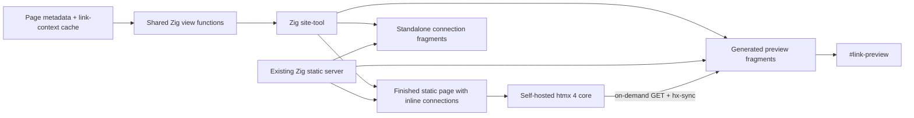
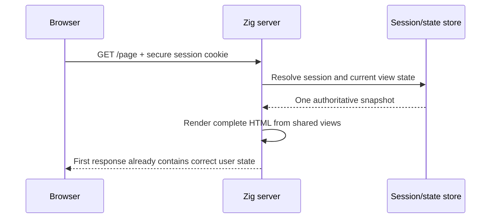

# htmx 4 Refactor Specification

Status: implemented and deployed with pinned beta6

Date: 2026-07-30

Repository baseline: `a75e3e1`

htmx baseline: `v4.0.0-beta6`, tag commit
`6ca11fbdc881a96c5fbeb0d7094a77183120ea22`

Post-refactor standardization update (2026-07-31): the repository now pins the
public `web.zig` library for context-safe HTML, HTTP/cache/asset/security
primitives, and HTMX metadata. Current CI and `scripts/smoke.sh` are completion
gates; later historical references in this document to deferring those gates
describe the narrower original refactor slice, not the repository's current
state.

## Executive decision

Adopt htmx 4 core as a narrowly scoped progressive-enhancement layer for
interactions initiated after the first paint, primarily annotated link
previews.

Generated article context must be materialized into each page by `site-tool`
before deployment. Keep its standalone HTML fragment as a canonical reusable
representation, but do not fetch it with `hx-trigger="load"` during initial
page display.

This creates a hard rendering boundary:

- state known at build time is present in the generated page;
- state known at request time must be present in the first server response; and
- htmx is used only for state requested or changed after the page is visible.

For the repository as it exists, all page state is public and build-time-known.
The Zig production server therefore remains a static file server and gains no
dynamic action routes, SSE protocol, application state, or htmx-specific SDK.

Keep the rest of the site unchanged:

- HTML remains the canonical page content.
- `site-tool` generates metadata, standalone fragments, and the finished page
  representations offline.
- Normal navigation remains ordinary `<a>` navigation.
- The CSS-only mobile menu remains CSS-only.
- `theme.js` remains responsible for pre-paint theme selection, session
  persistence, and cross-tab synchronization.
- A small external preview controller remains for pointer/focus behavior and
  viewport positioning.

The htmx layer owns on-demand preview requests, cancellation, and HTML swaps. It
does not own first-paint correction, theme state, navigation, page routing,
preview HTML construction, or external link enrichment.

## Implementation status

The refactor described by Slices 0–5 is implemented:

- `src/site/model.zig` and `src/site/views.zig` provide typed shared rendering;
- generated connection state is embedded in initial article responses and
  retained as byte-equivalent standalone fragments;
- HTMX beta6 is self-hosted, pinned, checksum-audited, and precompressed;
- the strict external HTMX config preserves the existing CSP;
- preview fragments and anchor attributes are generated deterministically;
- `preview-controller.js` owns input, focus, visibility, and geometry only;
- the legacy transclusion/annotation browser implementation and
  `annotations.json` transport are removed;
- `src/site/http_cache.zig` defines public and personalized request-rendering
  cache boundaries and representation-specific dynamic validators; and
- the old transport-specific shell harness is replaced by first-response,
  caching, compression, security, HTMX-fragment, and traversal smoke coverage;
  and
- CI regenerates committed output and runs formatting, unit, release-build, and
  HTTP smoke gates on the repository's exact Zig master pin.

Production deployment was explicitly authorized and completed on 2026-07-30.
The interactive-graph slice remains a future feature because no graph or data
model has been selected.

## Release-status gate

As of this specification, htmx 4 is a pre-release. The latest available tag is
`v4.0.0-beta6`, released on 2026-07-23. The beta6 release includes at least one
breaking event rename from beta5, so additional beta churn is plausible.

Recommended policy:

- Use beta6 only for the compatibility spike and implementation branch.
- Prefer waiting for the final `4.0.0` release before production deployment.
- If beta6 is deliberately deployed, pin its exact artifact and accept that a
  subsequent beta may require markup, event-name, or configuration changes.
- Re-run the complete acceptance matrix when moving from beta6 to stable 4.0.0.

Do not silently replace beta6 with `@next`, a moving branch, or an unpinned CDN
URL.

## Why htmx fits this repository

The current enhanced interactions already follow an HTML-fragment model:

- connection panels fetch generated HTML and insert it into a page;
- link previews are derived from committed metadata; and
- core content and navigation remain static HTML.

The connection request is unnecessary: the complete fragment already exists
when the page is generated. `site-tool` should call the same Zig view function
to write both the inline page component and the standalone connection fragment.

For previews, `site-tool` can generate one static HTML fragment per annotated
link, and `hx-sync` can ensure that the latest hover or focus request replaces
any older request.

No backend endpoint needs to interpret client state. The URL of the static
fragment is already the complete request state.

## Goals

- Eliminate initial-load fragment fetching for build-time-known content.
- Replace remaining on-demand fragment fetching and DOM insertion with htmx
  attributes.
- Move preview HTML assembly and sanitization from the browser to `site-tool`.
- Establish shared Zig view functions that can render the same component into a
  full page or a standalone fragment.
- Guarantee that server-known visible state is correct in the first response.
- Preserve the current CSP without adding `unsafe-eval` or `unsafe-inline`.
- Keep pages, preview fragments, and connection fragments static,
  precompressed, and cacheable.
- Preserve useful fallback content when JavaScript is disabled or requests fail.
- Preserve keyboard, pointer, coarse-pointer, and screen-reader behavior.
- Make rapid preview requests deterministic with declarative request
  synchronization.
- Keep the migration incremental and easy to roll back.

## Non-goals

- Converting the site into a single-page application.
- Using `hx-boost` for ordinary page navigation.
- Adding dynamic Zig routes or an htmx server library for the current public
  site.
- Adding SSE, WebSockets, polling, or the `htmax` extension bundle.
- Implementing a database, authentication, forms, or mutable server state in
  this refactor. The rendering contract for a possible future authenticated
  site is specified below so that those features do not reintroduce a flash.
- Moving theme selection into htmx.
- Replacing the CSS-only mobile navigation.
- Using `hx-on`, trigger filters, `js:`, or `javascript:` attribute values.
- Adding the htmx CSP extension or per-request nonces to the static page path.
- Adding Node, a browser-test framework, or CI automation in this milestone.

## Current-state inventory

| Concern | Current implementation | Target implementation |
| --- | --- | --- |
| Page serving | Zig streams `static/` | unchanged |
| Page metadata | generated by `site-tool` | unchanged |
| Connections | custom `fetch()` + `innerHTML` after load | inline build-time rendering |
| Annotation lookup | browser downloads one JSON file | generated fragment URL per anchor |
| Preview rendering | browser templates and sanitizes HTML | build-time Zig renderer |
| Preview request races | imperative active-anchor checks | `hx-sync="#link-preview:replace"` |
| Preview visibility | imperative JavaScript | small external controller |
| Preview positioning | imperative JavaScript | small external controller |
| Theme | `theme.js` | unchanged |
| Mobile navigation | CSS checkbox | unchanged |
| Compression | committed `.br`/`.gz` files | extended to htmx and preview files |

The former `site-features.js` is replaced by the much smaller
`preview-controller.js`. It may own geometry and input boundaries, but it must
not fetch resources, construct preview markup, parse annotation JSON, sanitize
HTML, transclude connections, or correct initial page state.

## Target architecture



Every network response in this design is an ordinary static HTML file. htmx
request headers are advisory; the server returns the same representation to
htmx, a browser navigation, or `curl`.

## First-response rendering invariant

The first HTML response must already contain the authoritative value of every
visible element whose state the server knows at response time.

This includes:

- authentication and account controls;
- permissions and available actions;
- navigation variants;
- notification or message counts;
- form values and validation state after a submission;
- generated article context; and
- any other content whose replacement would look like the page correcting
  itself.

No such element may use `hx-trigger="load"`, a startup `fetch()`, a delayed
signal, or a client-side session probe to discover what it should have rendered.
JavaScript-disabled and first-paint views must be semantically correct, not
merely acceptable placeholders.

Lazy loading remains appropriate only for information that is deliberately
absent until the user asks for it, such as a hover preview, or for optional
below-fold data where a stable loading state is itself the truthful state.

The current theme preference is a separate client-only case: it lives in
browser storage and `theme.js` applies it synchronously in `<head>` before
paint. Do not replace that mechanism with an htmx load request. If theme
preference later moves into a cookie, the request-time renderer may emit the
matching root attribute directly.

### Diagnosis of the earlier flash

The reported Go behavior is best described as a **flash of stale or incorrect
content**, not an htmx rendering bug:

1. the server returned generic, logged-out, or stale HTML;
2. the browser was allowed to paint it;
3. htmx initialized and issued another request for authoritative state; and
4. the response arrived and replaced the visible element.

htmx 4 does not remove this round trip. In the pinned beta6 source:

- initialization processes the body at `DOMContentLoaded`;
- a synthetic `load` trigger fires when htmx processes the element; and
- request handling awaits the browser's normal asynchronous `fetch()` before
  reading and swapping the response.

The browser may paint at any point before that second response arrives. A fast
server can make the flash shorter, but cannot make this architecture
first-paint-correct.

The official htmx 4 lazy-load pattern documents the same sequence—render a
placeholder, issue a load request, and swap when it arrives—and explicitly
warns about layout shift. That pattern is useful for intentionally deferred
content, but it is the wrong pattern for authentication or other immediately
visible authoritative state.

### Anti-flash rule

Use this decision rule for every component:

| Question | Rendering choice |
| --- | --- |
| Is the value known during the static build? | Materialize it into the page during `site-tool write` |
| Is it user-specific but known when the HTTP request arrives? | Resolve the session and render it into that response |
| Does it change because of the current user action? | Commit the change, recompute view state, and return the final fragment in the same response |
| Is it optional and requested only after interaction? | An htmx request is appropriate |
| Is it unknowable until slow background work finishes? | Show an honest pending state, then poll or stream deliberately |

Hiding the page until JavaScript finishes does not satisfy this invariant. It
turns an incorrect-content flash into a blank-screen delay and makes the
no-JavaScript experience worse.

## Shared Zig rendering model

Zig can provide the same server-rendered workflow associated with PHP, Rails,
Go templates, or other backend stacks. PHP is convenient because request-time
templating is conventional there; it has no unique rendering capability.

The key is to separate state resolution from deterministic HTML rendering.

### Proposed module boundary

Extract reusable markup and escaping code from `src/tools/site.zig` into:

```text
src/site/model.zig
src/site/views.zig
```

`model.zig` owns typed page, connection, annotation, and view-state structures.
`views.zig` owns only deterministic, auto-escaping render functions:

```zig
pub fn renderFullPage(writer: anytype, context: RenderContext) !void;
pub fn renderConnections(writer: anytype, context: RenderContext) !void;
pub fn renderPreview(writer: anytype, preview: PreviewView) !void;
pub fn renderAccountControls(writer: anytype, context: RenderContext) !void;
```

The exact names may change, but these constraints may not:

- render functions perform no file, database, session, or network access;
- callers resolve all data before rendering starts;
- text and attribute values use context-specific escaping helpers;
- control attribute names and URL shapes are fixed by code;
- a component has one renderer, whether embedded in a page or returned alone;
  and
- output is deterministic for a given typed context.

A future-capable context can be modeled without implementing authentication:

```zig
const Audience = union(enum) {
    public,
    authenticated: AccountSummary,
};

const Representation = enum {
    full_page,
    fragment,
};

const RenderContext = struct {
    page: PageView,
    connections: ConnectionsView,
    audience: Audience = .public,
    representation: Representation,
};
```

Do not pass raw cookies, request headers, database rows, or arbitrary maps into
view functions.

### Current public-site path

For the current repository:

1. `site-tool` constructs one public `RenderContext` for each page.
2. It calls `renderConnections()` once for the inline page region and once for
   the standalone metadata route, or reuses one rendered byte slice.
3. It renders preview fragments from the same typed annotation model.
4. It writes finished HTML and compressed siblings.
5. `webapp` streams those files unchanged.

This is build-time server rendering, sometimes called static site generation.
It is stronger than fetching a pre-generated fragment after load because the
browser receives the composed representation in its first response.

### Optional future authenticated path

If the site later gains login or request-specific data, build time cannot
precompute an unbounded set of per-user pages. The equivalent PHP-like design
is request-time server rendering:



The Zig server must resolve the session and all first-paint view state before
committing response headers or body bytes. It may render into a bounded buffer
and send the result, or stream only after the state snapshot is complete.

Here, “latest” means one internally consistent snapshot of the latest committed
state visible to the request handler. If another actor changes state after the
response is sent, no server-rendering technique can update an already displayed
page without a subsequent request, poll, or push channel.

For a normal browser navigation, render the complete document. For an htmx
targeted request, the server may render only the requested component. htmx 4
sets `HX-Request-Type: full` for body-level or selected responses and `partial`
for other targets, specifically to support this server choice.

The request type chooses a representation; it never chooses authorization.
Session validation and permission checks must run identically for full and
partial responses.

### Mutation response rule

For any future state-changing request:

1. authenticate and authorize;
2. validate input;
3. commit the mutation;
4. reload or derive an authoritative post-commit view snapshot; and
5. render the final affected component or components in that same response.

Do not return an optimistic logged-in/account state and then perform a separate
load-triggered correction. When one action changes multiple visible regions,
htmx 4 core can return out-of-band elements or `<hx-partial>` elements rendered
from the same post-commit snapshot.

### Personalized caching contract

Public generated pages and fragments retain the current shared-cache behavior.
If authenticated rendering is ever added:

- authenticated HTML responses use `Cache-Control: private, no-store`;
- shared/CDN caches must not store personalized representations;
- logout clears the session cookie and returns the logged-out final HTML in the
  same response;
- pages must not embed secrets in htmx attributes or client-visible signals;
  and
- session cookies use `Secure`, `HttpOnly`, and `SameSite=Lax` at minimum.

Do not attempt to cache arbitrary personalized documents with `Vary: Cookie`.
That is easy to misconfigure and produces an unbounded cache key space.

## Future interactive graphs and request-time generation

Interactive graphs are compatible with this architecture. They do not require
turning every route into a dynamic application or rendering every interaction
on the server.

Choose the rendering boundary from the interaction:

| Graph behavior | Recommended implementation |
| --- | --- |
| Data changes only when the site is deployed | Generate accessible HTML/SVG during `site-tool write` |
| User selects a range, metric, or grouping | htmx GET returns a freshly rendered HTML/SVG component |
| Default graph must show live data at first paint | Render the containing page on request from one data snapshot |
| Hover labels, pan, zoom, brushing, or animation | Small dedicated client JavaScript over server-supplied data |
| Low-frequency live refresh | Explicit refresh or bounded polling |
| Continuous multi-widget live dashboard | Reassess SSE/Datastar or another push-oriented design |
| Personalized graph | Request-time rendering with private/no-store policy |

The browser should not make a network request for every pointer movement. htmx
is well suited to coarse, discrete state transitions such as “30 days” to “one
year”; local JavaScript is better for high-frequency graphical interaction.

### Whole-page request rendering

Rendering the entire public site on request is technically reasonable at this
traffic level. If chosen, `webapp` would:

1. resolve the route;
2. load or reference an already parsed content model;
3. obtain any live graph/request state;
4. construct the typed `RenderContext`;
5. call `renderFullPage()` into a bounded response buffer; and
6. send it with validators and security headers.

Do **not** execute `site-tool`, spawn a build, rewrite `static/`, or recompress
the whole site for each request. Request-time rendering means calling the same
pure Zig view functions in memory.

Immutable content and parsed metadata should be loaded once at process startup
or embedded at build time. Per-request work should be limited to route
resolution, live/personal state lookup, graph calculation, and serialization.

The recommended deployment remains hybrid:

- keep pages static while every visible value is deployment-time data;
- make only graph fragment routes dynamic when filters are introduced; and
- make a full page dynamic only when its default first-paint representation
  must reflect request-time data.

This retains the current fast static path without preventing a later move to
fully request-rendered pages. With the estimated audience, either approach is
fast enough; the hybrid boundary mainly reduces invalidation, abuse, and
operational complexity.

### Graph representation

Prefer server-rendered inline SVG inside an HTML `<figure>` for the first graph
implementation:

- SVG works without a canvas library;
- labels, descriptions, links, and fallback tables can remain accessible;
- output can be rendered with the existing strict CSP;
- htmx can swap the complete component; and
- the same renderer can produce build-time and request-time output.

Example progressive-enhancement markup:

```html
<form
    action="/graphs/traffic"
    method="get"
    hx-get="/_fragments/graphs/traffic"
    hx-target="#traffic-graph"
    hx-swap="outerSync"
    hx-sync="this:replace"
>
    <label>
        Range
        <select name="range">
            <option value="30d">30 days</option>
            <option value="1y">One year</option>
        </select>
    </label>
    <button type="submit">Update graph</button>
</form>

<figure id="traffic-graph">
    <!-- Authoritative default SVG and summary are already rendered here. -->
</figure>
```

The non-htmx `action` returns a complete graph page. The htmx URL returns only
the matching `<figure>` component. Both call the same `renderTrafficGraph()`
view function.

Use separate full-page and fragment URLs rather than returning different
representations from one cache key:

```text
GET /graphs/traffic?range=30d
GET /_fragments/graphs/traffic?range=30d
```

This avoids varying a response on htmx request headers. If a future route does
return full or partial HTML from the same URL based on `HX-Request-Type`, it
must send `Vary: HX-Request-Type`, as htmx's caching guidance requires.

### Request pipeline

The dynamic graph handler performs these steps:

1. parse and normalize the route and query;
2. reject unknown parameters and values outside fixed bounds;
3. obtain the graph data and a stable data revision;
4. construct an immutable `GraphView`;
5. compute the representation validator;
6. answer a matching conditional GET with `304 Not Modified`;
7. otherwise render the component into a bounded buffer; and
8. send HTML with the route's cache policy and normal security headers.

The graph renderer performs no query parsing, file reads, or database access.
It receives only typed, bounded values.

### Cache-key contract

A public graph representation key contains:

```text
route
+ representation kind (full page or fragment)
+ canonical parameter values
+ authoritative data revision
+ graph renderer version
+ content encoding, when encoded dynamically
```

Canonicalization is mandatory:

- accept only documented parameters;
- map aliases to one value or reject them;
- sort or structurally encode parameters rather than hashing the raw query;
- clamp neither silently nor differently across routes;
- bound ranges, point counts, label lengths, and output size; and
- ensure semantically identical queries produce the same key.

The renderer version is an explicit constant changed whenever markup or graph
semantics change. The data revision can be a source-file digest, database
revision, import timestamp plus digest, or monotonically increasing version.

If every input and revision is reliable and rendering is deterministic, hash
the complete key to form the ETag without rendering first. This lets a
conditional request avoid graph computation as well as response bytes. If a
reliable data revision is unavailable, render first and hash the response
bytes; that still saves transfer but not compute.

### Cache policy matrix

The initial implementation should use:

| Representation | Cache-Control | Validator | Server memory cache |
| --- | --- | --- | --- |
| Versioned CSS/JS/images | `public, max-age=31536000, immutable` | existing ETag | none |
| Generated public pages/fragments | `public, max-age=0, must-revalidate` | existing ETag + Last-Modified | none |
| Public request-rendered graph | `public, max-age=0, must-revalidate` | key-derived ETag | none initially |
| Public graph where 60 seconds of staleness is acceptable | `public, max-age=60` | key-derived ETag | optional |
| Personalized page or graph | `private, no-store` | omit | never shared |
| Validation errors and failures | `no-store` | omit | none |

This repository already implements the first two rows for static files. htmx
uses normal browser HTTP caching, so no htmx-specific client cache is required.
The existing global `noSwap` list includes `304`.

At the site's current traffic, the default public dynamic policy should remain
`max-age=0, must-revalidate`. It prioritizes freshness and simple invalidation.
A returning browser sends `If-None-Match`; the server can return a bodyless
`304` when the data revision and normalized inputs have not changed.

### Why not add an in-memory cache immediately

Rendering ten or fifteen human visits per day or week is negligible unless the
graph computation itself is unusually expensive. Bots make an unbounded cache
more dangerous because they can manufacture query combinations that consume
memory.

Start without an application cache. Add one only after measurements show a
meaningful render cost or repeated hot keys. If needed, the first server cache
must be:

- process-local and disposable;
- fixed at no more than 64 entries and 8 MiB total by default;
- LRU- or TTL-bounded;
- keyed by the exact canonical representation key above;
- limited to public representations;
- invalidated by changing data or renderer versions, not manual deletion; and
- instrumented with hit, miss, eviction, render-time, and output-size counters.

Do not add Redis, a database cache table, or a disk cache for this traffic
profile. Do not cache arbitrary raw query strings or personalized responses.

If concurrent profiling later reveals duplicate expensive renders for the same
key, add one in-flight computation per key so followers await the first render.
That is a later optimization, not part of the initial graph implementation.

### Dynamic compression

Keep the first implementation simple:

- send small dynamic graph fragments as identity;
- buffer and gzip larger public responses only if measurement justifies it;
- do not require request-time Brotli;
- include `Vary: Accept-Encoding` whenever dynamic content negotiation is used;
  and
- ensure encoded variants have distinct strong ETags, or use a correctly
  defined weak validator.

The existing precompressed Brotli/gzip path remains preferable for build-time
graphs.

### Graph safety and abuse limits

Even with low legitimate traffic, graph routes are public bot targets:

- use GET only for read-only graphs;
- use enumerated ranges and aggregation levels;
- cap source rows, plotted points, response bytes, and execution time;
- reject unknown/invalid inputs with `400` and `no-store`;
- never accept a filesystem path, SQL fragment, expression, color declaration,
  or HTML/SVG markup from query parameters;
- escape all labels and descriptions;
- expose a tabular or textual summary for accessibility; and
- add rate limiting at the reverse proxy only if observed traffic warrants it.

### Graph testing and acceptance

Add tests for:

- identical canonical inputs producing identical bytes and ETags;
- parameter order not changing the cache key;
- a changed data revision or renderer version changing the ETag;
- matching `If-None-Match` returning a bodyless `304`;
- full-page and fragment routes never sharing a representation key;
- public, personalized, and error cache policies;
- input cardinality, range, point-count, time, and output limits;
- hostile labels being escaped in HTML and SVG contexts;
- the default visible graph being present in the first response;
- rapid filter changes showing only the latest response via `hx-sync`; and
- normal form submission working without JavaScript.

Benchmark graph computation separately from HTML/SVG serialization. Add a
server memory cache only when the uncached measured cost justifies its
complexity.

## Dependency policy

### Frontend artifact

For the beta spike:

- Pin `htmx.org@4.0.0-beta6`.
- Commit the minified core bundle as `static/vendor/htmx.min.js`.
- Commit its Zero-Clause BSD license as
  `static/vendor/htmx.LICENSE.txt`.
- Record the version, tag commit, upstream URL, and SHA-256 in
  `static/vendor/htmx.version`.
- Expected beta6 minified artifact SHA-256:
  `28fae7bbe8e8142b702debb9d5234a9a436d9435a4b5165b195aa1a7ed840d25`.
- Include it through a content-versioned local URL:

  ```html
  <script defer src="/vendor/htmx.min.js?v=<content-hash>"></script>
  ```

Do not load production htmx from a CDN.

Measured for this specification, the beta6 core bundle is approximately:

- 36.3 KB minified;
- 12.8 KB gzip-compressed; and
- 11.6 KB Brotli-compressed.

Use core `htmx.min.js`, not `htmax.js`. The latter bundles extensions this site
does not need.

### No backend dependency

Do not add `build.zig.zon`, an htmx server package, or an htmx import to
`webapp`. htmx requests ordinary HTML over ordinary GET requests, which the
existing server already supports.

## CSP and security contract

The current CSP remains:

```text
script-src 'self' https://plausible.plosca.ru
```

The implementation must avoid htmx features that evaluate JavaScript strings:

- no `hx-on:*`;
- no event filters such as `keyup[key == 'Enter']`;
- no `js:` or `javascript:` values;
- no inline event handlers; and
- no script-bearing swapped fragments.

Core request attributes, static trigger names, selectors, swaps, and
synchronization do not require `unsafe-eval`.

The page should include an explicit configuration meta element:

```html
<meta
    name="htmx-config"
    content='{"mode":"same-origin","history":false,"noSwap":[204,304,"4xx","5xx"]}'
/>
```

Rationale:

- `mode: "same-origin"` is already the htmx 4 default, but making it explicit
  documents the security boundary.
- `history: false` prevents htmx from intercepting back/forward navigation. This
  site does not use boosted navigation or htmx-managed URLs.
- htmx 4 swaps error responses by default. This server returns the complete
  `404.html` page for missing static fragments, so swapping `4xx` or `5xx`
  responses would corrupt a fragment target. `noSwap` preserves the fallback.

Third-party-derived preview HTML must be allowlisted at build time. Its wrapper
must carry `hx-ignore` so htmx never interprets injected `hx-*` or `data-hx-*`
attributes:

```html
<div class="link-preview__content" hx-ignore>
    ...
</div>
```

The build-time sanitizer must:

- allow only the existing approved preview tags;
- allow only safe `href` protocols on links;
- strip scripts, styles, frames, objects, event-handler attributes,
  `hx-*`, and `data-hx-*`;
- escape text and attribute values; and
- fail closed on malformed markup.

The `hx-csp` extension is not required because this design avoids eval-capable
features. Its nonce-gating mode expects per-response nonces, which does not fit
committed, precompressed static HTML without changing the serving model.

## htmx configuration contract

Use direct attributes rather than implicit inheritance. htmx 4 defaults to
explicit inheritance, and all relevant elements are generated by `site-tool`.

Required configuration:

```json
{
  "mode": "same-origin",
  "history": false,
  "noSwap": [204, 304, "4xx", "5xx"],
  "defaultTimeout": 10000
}
```

The 10-second timeout is intentionally shorter than htmx 4's 60-second default
because every enhanced request is a same-host static-file read. A request that
takes 10 seconds is not useful to an on-demand preview.

Do not enable:

- history handling;
- boosted navigation;
- global view transitions;
- cross-origin request mode;
- inline script execution; or
- extensions.

## Generated artifact contracts

### Connection fragments

Each generated connection component gets a stable root ID:

```html
<div id="connections-hello-world" class="generated-connections">
    ...
</div>
```

`site-tool` materializes that complete component into the page:

```html
<!-- generated:connections:start -->
<div id="connections-hello-world" class="generated-connections">
    ...
</div>
<!-- generated:connections:end -->
```

The same rendered component is also written to:

```text
static/metadata/connections/hello_world.html
```

The standalone route remains useful for direct inspection, linking, reuse, and
testing. It is not an initial-page dependency.

Requirements:

- The inline page component and fragment bytes come from the same renderer.
- Page and fragment root IDs must match.
- Regeneration replaces only the bounded generated marker region.
- Repeated generation is byte-for-byte idempotent.
- The full inline component is present with JavaScript disabled.
- Loading a page issues no connection-fragment request.
- The generated page and fragment contain no `hx-trigger="load"`.

### Preview fragments

For every previewable annotation, generate:

```text
static/metadata/previews/<16-lowercase-hex-key>.html
```

The key is the existing stable short hash of the normalized annotation href.
Hash collisions must fail the build before writing files.

Each file contains one complete preview root:

```html
<aside
    id="link-preview"
    class="link-preview link-preview--article"
    role="status"
    aria-live="polite"
>
    ...
    <div class="link-preview__content" hx-ignore>
        <!-- escaped, allowlisted preview HTML -->
    </div>
    ...
</aside>
```

The page owns one stable target:

```html
<aside
    id="link-preview"
    class="link-preview"
    role="status"
    aria-live="polite"
    hidden
></aside>
```

### Preview anchors

`site-tool` decorates each eligible anchor with fixed attributes:

```html
<a
    href="https://example.com/"
    data-previewable="true"
    hx-get="/metadata/previews/0123456789abcdef.html"
    hx-trigger="preview:request"
    hx-target="#link-preview"
    hx-swap="outerSync"
    hx-sync="#link-preview:replace"
>
    Example
</a>
```

Only the generated fragment key varies. No title, summary, external URL, or
third-party string may appear in an htmx control attribute.

The custom `preview:request` event is dispatched by
`preview-controller.js`. Using a custom event instead of `mouseenter, focus`
directly lets the controller preserve the current coarse-pointer and focus
rules without event-filter expressions or inline code.

The controller must:

- use event delegation so generated/swapped elements need no direct listeners;
- dispatch `preview:request` for hover-capable pointer entry and keyboard focus;
- never prevent a link's normal click behavior;
- track the active anchor for positioning only;
- hide the target on pointer/focus exit after the current 160 ms grace period;
- close on Escape, scroll, resize, or an outside pointer action;
- position after `htmx:after:swap`; and
- leave the fallback target hidden when a request fails.

The controller must not call `fetch()`, `htmx.ajax()`, or `htmx.swap()`.

### Request synchronization

Every preview anchor uses:

```text
hx-sync="#link-preview:replace"
```

All preview requests therefore share the preview target's request queue. A new
request aborts an older request before starting, preventing a slow response for
an earlier anchor from replacing a newer preview.

This must be verified against the pinned beta because htmx 4 request and event
internals are still pre-release.

## HTTP behavior

The existing server needs no htmx-specific branch:

```text
GET /metadata/connections/hello_world.html
GET /metadata/previews/0123456789abcdef.html
```

Both return:

- `Content-Type: text/html; charset=utf-8`;
- existing HTML cache validators;
- `Cache-Control: public, max-age=0, must-revalidate`;
- existing security headers; and
- precompressed Brotli/gzip variants when negotiated.

htmx 4 adds headers such as `HX-Request-Type`, `HX-Source`, `HX-Target`, and
`Accept: text/html`. The server returns the same representation regardless of
those headers, so it must not add `Vary` for them.

Missing fragments use the existing full-page 404 response. Global `noSwap`
configuration prevents that response from replacing a fragment target.

## Theme and navigation

Do not migrate these features:

- `theme.js` must run before paint and coordinates `sessionStorage`, system
  preference, and `BroadcastChannel`.
- The mobile menu works without JavaScript through a checkbox and CSS.
- Ordinary links already provide correct URLs, history, open-in-new-tab,
  downloads, and no-JavaScript behavior.

Do not add `hx-boost` to `<body>`, navigation, article links, or archive links.

## File-level change map

| File | Planned change |
| --- | --- |
| `src/main.zig` | Reuse shared cache/validator policy while preserving the static fast path |
| `src/site/http_cache.zig` | Add public/personalized policies and representation-specific render ETags |
| `src/site/model.zig` | Add typed page, connection, annotation, and render-context models |
| `src/site/views.zig` | Add shared deterministic, escaping HTML component renderers |
| `src/site/graphs.zig` | Future: typed graph calculation and bounded public query models |
| `src/tools/site.zig` | Compose finished pages, connection/preview fragments, stable IDs, htmx attributes, runtime hashes, and audits |
| `src/styles/site.css` | Add preview request/failure states without visual redesign |
| `static/vendor/htmx.min.js` | Add pinned self-hosted htmx 4 core |
| `static/vendor/htmx.LICENSE.txt` | Add upstream Zero-Clause BSD license |
| `static/vendor/htmx.version` | Record version, commit, URL, and checksum |
| `static/site-features.js` | Replace with geometry/input-only `preview-controller.js` |
| `static/theme.js` | No behavioral change |
| `static/*.html` | Add config meta, runtime reference, inline generated context, targets, and generated attributes |
| `static/metadata/previews/*.html` | Add generated preview fragments |
| `scripts/smoke.sh` | Delete the obsolete shell smoke harness; do not replace it in this milestone |

Do not add `build.zig.zon`, npm metadata, a browser harness, a CI workflow, or
an htmx server module in this milestone.

All generated `.br` and `.gz` siblings remain committed and checked.

## Migration sequence

### Slice 0: beta and CSP compatibility spike

1. Self-host beta6 on an isolated test page.
2. Use the unchanged production CSP.
3. Verify a custom event, `outerSync`, and `hx-sync`.
4. Verify that no `unsafe-eval`, inline-script, or style CSP violation occurs.
5. Verify that `4xx`/`5xx` responses do not swap under the proposed config.
6. Record any beta-specific API assumptions.

No production page behavior changes in this slice.

Definition of done:

- the exact HTMX artifact, upstream revision, checksum, and license are recorded;
- the proposed production CSP is exercised without adding an exception;
- the custom trigger, `outerSync`, `hx-sync`, and error no-swap behavior pass in
  a focused local browser review; and
- all beta assumptions are isolated in the version record and upgrade notes.

### Slice 1: runtime and asset integration

1. Add the pinned artifact, license, and version metadata.
2. Add htmx to asset versioning and compressed-asset generation.
3. Add the config meta and versioned script reference.
4. Extend `check-site` to verify checksums, version references, and forbidden
   eval-capable attributes.

Keep the legacy frontend active during this slice.

Definition of done:

- the pinned HTMX runtime and compressed siblings are generated reproducibly;
- every page references the content-versioned local runtime and external config;
- `check-site` rejects a checksum mismatch, CDN reference, stale version, or
  prohibited eval-capable HTMX construct; and
- the release server serves the identity, Brotli, and gzip representations with
  the existing CSP and validators.

### Slice 2: first-response composition

1. Extract typed models, escaping helpers, and connection rendering into shared
   Zig modules.
2. Add bounded generated-region markers to eligible source pages.
3. Materialize the complete connection component into each finished page.
4. Write the standalone fragment from the exact same component renderer.
5. Remove `initTransclusions()` from the legacy script.
6. Add an audit that rejects initial-load state-correction requests.
7. Verify deterministic regeneration, no-JS completeness, and zero
   connection-fragment requests during page load.

Definition of done:

- one typed Zig renderer produces both embedded and standalone connection HTML;
- every eligible page contains its final connection state in the first response;
- generation is byte-for-byte idempotent and marker replacement fails closed;
- the legacy startup transclusion request path is absent; and
- generated-output inspection confirms complete content without a startup
  connection request or state-correction hook.

### Slice 3: build-time preview model

1. Refactor annotation generation into a typed intermediate representation.
2. Render both the existing JSON and new allowlisted preview HTML from it.
3. Generate stable keys and fail on collisions.
4. Delete orphaned preview files during regeneration.
5. Add generated htmx attributes to eligible anchors.
6. Keep the legacy preview implementation active until the controller is ready.

Definition of done:

- one typed annotation model produces JSON compatibility output and allowlisted
  preview fragments;
- preview keys are deterministic, collision-checked, and orphan files are
  removed;
- eligible anchors have valid fragment URLs and synchronization attributes;
- all generated HTML is escaped according to text, attribute, and URL context;
  and
- `check-site` proves every decorated anchor resolves to one generated fragment.

### Slice 4: htmx preview cutover

1. Add the stable global preview target.
2. Replace the legacy feature script with `preview-controller.js`.
3. Dispatch custom preview requests and position after swaps.
4. Verify `hx-sync` under rapid pointer and keyboard movement.
5. Remove browser-side annotation lookup, templating, and sanitization.

Definition of done:

- HTMX exclusively owns preview HTTP requests, cancellation, and DOM swaps;
- the first-party controller owns only input boundaries, visibility, focus, and
  geometry;
- rapid pointer and keyboard changes cannot display an older response;
- Escape, outside pointer, scroll, resize, and blur behavior pass a focused
  local interaction review;
- coarse-pointer taps retain ordinary navigation; and
- the old browser annotation fetch, HTML templating, sanitizer, and feature
  script no longer exist in source or generated pages.

### Slice 5: hardening and stable-release adoption

1. Run the htmx upgrade checker against the repository.
2. Update from beta6 to final 4.0.0 when available.
3. Re-run all CSP, error-swap, event-name, synchronization, and browser checks.
4. Remove beta-specific compatibility code.
5. Remove `annotations.json` because it has no remaining public consumer.
6. Run the repository checks and release build; keep deployment as a separate
   explicit action.

Definition of done:

- the repository uses the selected reviewed HTMX 4 release with no obsolete
  beta compatibility branch;
- generated-output and focused Zig checks cover the static rendering contracts;
- a targeted local browser review finds no CSP or console errors in the changed
  interactions;
- the shell smoke harness is gone without a replacement CI or browser suite; and
- deployment remains an explicit separate operation unless requested.

### Future slice: request-time personalized rendering

This slice is not part of the current refactor. If authentication is added:

1. add a session resolver in front of rendering;
2. construct one authoritative `RenderContext` per request;
3. reuse `views.zig` for full and partial responses;
4. commit mutations before rendering their response;
5. add private/no-store cache policy for personalized HTML; and
6. add first-paint identity and permission tests before deployment.

Definition of done:

- session and authorization resolution completes before rendering starts;
- full and fragment responses use one authoritative render context;
- mutations render only committed state;
- personalized responses are private/no-store; and
- logged-out and authenticated first responses contain the correct identity and
  permissions without a client-side correction path.

### Future slice: interactive graphs

This slice remains outside the implemented refactor and may be implemented
independently of authentication:

1. add one typed SVG graph renderer and accessible summary;
2. generate its default public state into the page;
3. add distinct full-page and fragment GET routes for filter changes;
4. normalize an enumerated query model and compute a versioned ETag;
5. reuse existing conditional-request and security-header helpers;
6. start with `public, max-age=0, must-revalidate` and no memory cache;
7. add input, output, execution-time, and bot-abuse bounds;
8. add conditional GET, no-JS form, rapid-filter, and first-paint tests; and
9. benchmark before considering an in-process LRU.

Definition of done:

- the default graph, accessible summary, and fallback form are useful without
  JavaScript and are present in the first response;
- a bounded typed query produces deterministic full and fragment renders;
- representation-specific validators and revalidation caching behave correctly;
- rapid filter changes cannot display stale graph state;
- invalid or abusive inputs are bounded before expensive work; and
- browser automation for first paint, filtering, history, and accessibility is
  handled in its own later milestone before any application cache is added.

## Testing specification

### Site-tool checks

- Vendored runtime version and SHA-256 match metadata.
- Every HTML runtime reference uses the current content hash.
- No CDN htmx reference exists.
- No `hx-on`, event-filter, `js:`, `javascript:`, `hx-boost`, or extension
  attribute exists.
- Config keeps `mode` at `same-origin`, disables history handling, and
  suppresses `4xx`/`5xx` swaps.
- No visible, server-known component uses `hx-trigger="load"`, startup
  `fetch()`, or an equivalent state-correction hook.
- Every page with generated context contains the complete expected connection
  component inline.
- Inline and standalone connection components are produced by the same renderer.
- Every previewable anchor maps to exactly one generated preview file.
- No preview hash collision or orphaned fragment exists.
- Connection target and fragment IDs match.
- Preview derived-content wrappers contain `hx-ignore`.
- Preview HTML contains only allowlisted tags and attributes.
- External strings never occur in htmx control attributes.
- Compressed siblings are current.

### Zig unit tests

Existing server tests remain authoritative:

- route normalization and traversal rejection;
- static exact/HTML/index resolution;
- content types;
- cache policies;
- compression negotiation;
- validators and conditional requests; and
- known local routes.

Add generated preview and vendor routes to the known-route test. No dynamic
handler tests are required because the server contract does not change.

Add shared-renderer tests:

- public render contexts produce deterministic output;
- connection output embedded in a page matches standalone component output;
- all text and attribute contexts escape adversarial input;
- full and fragment renderers use the same authorization-independent component
  code; and
- generated-region replacement is idempotent and fails closed on missing or
  duplicate markers.

If request-time rendering is later implemented, add tests that:

- resolve the session before the first response byte;
- render logged-out and authenticated documents correctly from their cookies;
- apply identical authorization to full and partial requests;
- render post-mutation state from a committed snapshot; and
- attach private/no-store policy to personalized HTML.

### Deferred browser-automation milestone

Automated browser journeys and CI are intentionally outside this refactor. A
later milestone may add them for first-paint correctness, CSP behavior, rapid
preview changes, keyboard and coarse-pointer interaction, history, compression,
conditional requests, and missing-fragment behavior. They are not current
dependencies or completion gates.

## Performance and operational budgets

- htmx core must remain at or below 14 KB Brotli-compressed unless reviewed.
- Total first-load first-party JavaScript must remain at or below 18 KB
  Brotli-compressed.
- The replacement preview controller should remain below 2.5 KB
  Brotli-compressed.
- Do not preload htmx.
- All fragment routes remain cache-revalidated static HTML.
- No request-time external network access is allowed.
- No preview request may remain active after a newer preview request begins.
- No first-paint-correct component depends on a second request.
- Ordinary page traffic must retain the existing static streaming fast path.

This refactor increases JavaScript relative to the current implementation. Its
value must come from a simpler fragment architecture and build-time content
safety, not from an unsupported performance claim.

## Observability

No new server logging is necessary because htmx uses existing static routes.

During development:

- listen for htmx request/error/swap events from external JavaScript;
- log only under an explicit debug flag;
- verify missing-fragment failures in the browser console; and
- never log full external hrefs solely for preview debugging.

Do not ship always-on htmx event logging.

## Rollback

The legacy implementation was removed after the generated-output, focused Zig,
and local interaction checks passed. A rollback from version control consists
of:

1. restoring the legacy `site-features.js`;
2. removing the htmx script and config meta;
3. removing generated htmx attributes; and
4. regenerating compressed static assets.

Generated preview fragments are inert static files and may remain until a later
cleanup.

## Acceptance criteria

The refactor is complete when:

- Generated connection content is present in the first page response.
- htmx owns on-demand preview requests, cancellation, and swaps.
- First-party preview JavaScript owns only input boundaries and geometry.
- Preview HTML is rendered and sanitized at build time.
- Shared Zig renderers produce inline and standalone component representations.
- No server-known visible state is corrected after page load.
- The Zig server remains a generic static server.
- The existing CSP remains unchanged and produces no violations.
- No eval-capable htmx feature is present.
- No-JavaScript content and navigation remain complete.
- The htmx artifact is self-hosted, pinned, compressed, and license-audited.
- The focused Zig checks and release build pass.
- A targeted local browser review covers the HTMX interaction paths changed by
  this refactor.
- CI and browser automation remain explicitly deferred and are not current
  completion gates.
- A live production check is performed only as part of an explicitly requested
  deployment.
- A conscious decision has been made to wait for stable 4.0.0 or accept beta
  deployment risk.

## Alternatives considered

### Initial `hx-trigger="load"` requests

This is htmx's intentional lazy-load pattern. It necessarily shows the
server-delivered placeholder until another request completes, so it cannot
guarantee correct first-paint identity or permissions. It is prohibited for
server-known visible state.

### Hiding or cloaking unresolved content

CSS can reserve space or hide content until a request settles. That can reduce
layout shift, but it replaces a wrong-state flash with blank space or a loading
flash. It also makes correctness depend on JavaScript. Use it only for honestly
deferred optional content, not account chrome or generated page content.

### Preload and optimistic extensions

Preloading can begin a request earlier, but it cannot make the response part of
the original HTML and cannot guarantee that it wins the first-paint race.
Optimistic rendering deliberately shows an expected state before the
authoritative response. Neither is suitable for identity, authorization, or
permissions.

### Dynamic preview endpoint

A server endpoint could accept a preview key and render or select a fragment.
That adds routing, input validation, and no-store dynamic responses without
improving a corpus that is already generated offline. Direct static fragment
URLs are simpler.

### SSE or `htmax`

The site has no server-pushed or mutable state. Core htmx request/response
swapping is sufficient, so extension bundles and streaming transports are out
of scope.

### `hx-boost` navigation

Normal browser navigation already provides correct history, deep links,
downloads, open-in-new-tab behavior, and graceful degradation. Boosting every
link would expand the regression surface without improving the two target
features.

### Inline `hx-on` behavior

Inline expressions would improve locality but require eval-related CSP
considerations. A small self-hosted controller preserves the strict policy and
keeps layout-sensitive behavior in normal JavaScript.

### htmx CSP extension

Nonce gating and Trusted Types are valuable for a dynamic server-rendered
application. This repository serves committed, precompressed pages and does not
need eval-capable htmx features, so introducing per-response nonces would be a
larger architectural change than the refactor itself.

## Primary references

- [htmx 4 documentation](https://four.htmx.org/docs)
- [htmx 4 migration guide](https://four.htmx.org/docs/get-started/migration)
- [htmx 4 beta6 initialization source](https://github.com/bigskysoftware/htmx/blob/6ca11fbdc881a96c5fbeb0d7094a77183120ea22/src/htmx.js#L188-L197)
- [htmx 4 beta6 load-trigger source](https://github.com/bigskysoftware/htmx/blob/6ca11fbdc881a96c5fbeb0d7094a77183120ea22/src/htmx.js#L866-L870)
- [htmx 4 beta6 request source](https://github.com/bigskysoftware/htmx/blob/6ca11fbdc881a96c5fbeb0d7094a77183120ea22/src/htmx.js#L603-L621)
- [htmx lazy-load pattern](https://four.htmx.org/patterns/lazy-load/)
- [`HX-Request-Type` reference](https://four.htmx.org/reference/headers/HX-Request-Type)
- [htmx caching guidance](https://four.htmx.org/docs#caching)
- [htmx guidance on high-frequency UI state](https://htmx.org/essays/when-to-use-hypermedia/)
- [htmx authentication and server-rendering security guidance](https://htmx.org/essays/web-security-basics-with-htmx/)
- [htmx 4 security guidance](https://four.htmx.org/docs#best-practices)
- [hx-trigger reference](https://four.htmx.org/reference/attributes/hx-trigger)
- [hx-swap reference](https://four.htmx.org/reference/attributes/hx-swap)
- [hx-sync reference](https://four.htmx.org/reference/attributes/hx-sync)
- [htmx history configuration](https://four.htmx.org/reference/config/htmx-config-history)
- [hx-csp extension](https://four.htmx.org/extensions/hx-csp)
- [RFC 9110 entity tags](https://www.rfc-editor.org/rfc/rfc9110.html#section-8.8.3)
- [RFC 9110 conditional `If-None-Match`](https://www.rfc-editor.org/rfc/rfc9110.html#section-13.1.2)
- [RFC 9111 Cache-Control](https://www.rfc-editor.org/rfc/rfc9111.html#section-5.2)
- [htmx beta6 release](https://github.com/bigskysoftware/htmx/releases/tag/v4.0.0-beta6)
